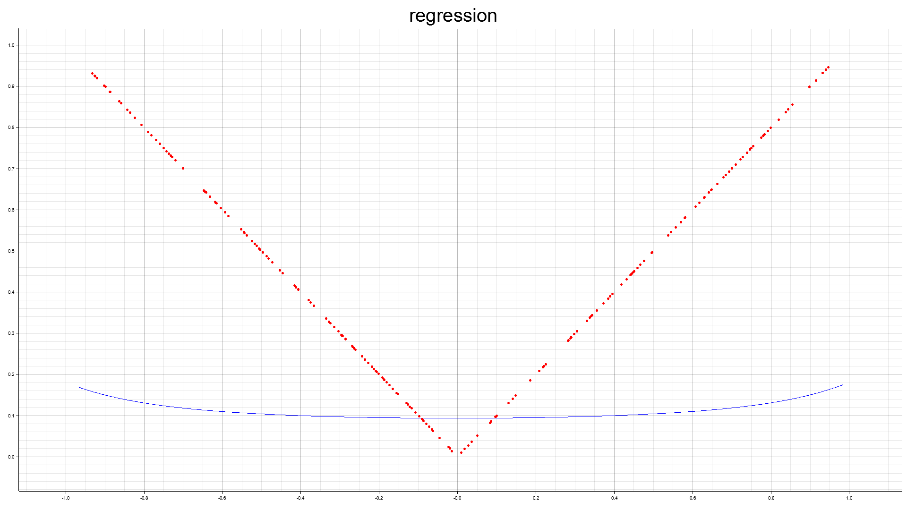

# 補間に関する数値実験

区間 $[-1, 1]$ 上で使用するのが良いと思われる。（多項式の評価で数値誤差が大きくなるため。）

コードは雑に書いている。

- [ ] SGDの実装。
- [ ] 次元による場合分け。
- [ ] 2次元の補間実装。
- [ ] 高速化。

## 行列を陽には使わない素朴な方法

1次元の場合。 $M$ 個の2次元のデータの集合を $\boldsymbol{x}$ とする。

$$
\boldsymbol{x} = \left\lbrace(x_{0}, y_{0}), (x_{1}, y_{1}), \dots (x_{M-1}, y_{M-1}) \right\rbrace
$$

多項式を以下の $N-1$ 個からなる数列 $\boldsymbol{a}$ で表す。

$$
\boldsymbol{a} = \left\lbrace a_{0}, a_{0}, \dots a_{N-1} \right\rbrace
$$

すなわち、この数列 $\boldsymbol{a}$ よりなる $N-1$ 次多項式で表された関数 $f_{\boldsymbol{a}}(x)$ は以下のようになる。

$$
f_{\boldsymbol{a}}(x) = \sum_{i=0}^{N-1} a_{i} x^{i}
$$

この時多項式の係数 $\boldsymbol{a}$ を変化させてデータ $x$ を表現するのに「最適」なものを数値計算で求める（ここでの「最適」は評価した後と実際の値との差の2乗が小さいものとする。）。

ここでポテンシャル $U$ （この言葉は物理学からの借用）を以下に定義する。要するにスカラー値関数で最小値を取るような $\boldsymbol{a}$ を取ることができれば良い。

$$
U(\boldsymbol{x}, \boldsymbol{a}) = \frac{1}{M} \sum_{j=0}^{M-1} \left\lbrace y_{j} - \sum_{i=0}^{N-1}a_{i}x^{i}_{j} \right\rbrace^{2}
$$

多項式の係数から1つ $a_{k}$ 取って偏微分する。

$$
\frac{\partial U(\boldsymbol{x}, \boldsymbol{a})}{\partial a_{k}} = - \frac{2}{M} \sum_{j=0}^{M-1} x_{j}^{k} \left\lbrace y_{j} - \sum_{i=0}^{N-1}a_{i}x^{i}_{j} \right\rbrace
$$

ここでパラメータ $t$ （時間だと思えば良い）を $\boldsymbol{a}$ に導入する。つまり

$$
\boldsymbol{a}(t) = \left\lbrace a_{0}(t), a_{0}(t), \dots a_{N-1}(t) \right\rbrace
$$

とする。この $\boldsymbol{a}(t)$ の時間発展を常微分方程式で記述する。以下の勾配に沿って変化させるのが一番素朴な方法であろう。右辺は各 $a_{k}$ で偏微分したベクトル値として表記した。（汎関数。）

$$
\frac{d \boldsymbol{a}(t)}{dt} = - \frac{\partial U(\boldsymbol{x}, \boldsymbol{a}(t))}{\partial \boldsymbol{a}}
$$

初期条件の取り方は問題によるがすべて $0$ にするのが一般的だろう。簡単な計算により時刻 $t$ が大きくなればポテンシャル $U$ は単調減少することがわかる。（所謂勾配降下法である。）

あとは常微分方程式（ODE）の数値解法で解ける。このODEの力学系の漸近安定平衡点を見つける問題に帰着する。漸近安定平衡点への過渡情報は要らないのでポテンシャル $U$ が減る分には時間刻みは大きく取って良い。

### その他の方法の提案

慣性の追加。運動方程式としてみる。 $C$ は抵抗パラメータ。

$$
\frac{d^{2} \boldsymbol{a}(t)}{dt^{2}} + C \frac{d \boldsymbol{a}(t)}{dt} = - \frac{\partial U(\boldsymbol{x}, \boldsymbol{a}(t))}{\partial \boldsymbol{a}}
$$

ポテンシャルに条件を付加する。L2正則化（パラメータを $\lambda$ とする。）。

$$
U(\boldsymbol{x}, \boldsymbol{a}) = \frac{1}{M} \sum_{j=0}^{M-1} \left \lbrace y_{j} - \sum_{i=0}^{N-1} a_{i}x^{i}_{j} \right \rbrace^{2} + \lambda \sum_{i=0}^{N-1} a_{i}^{2}
$$

これらの方法で漸近安定平衡点に速く収束させられるかは未調査である。

## $M=N$ の場合

多項式の係数 $\boldsymbol{a}$ は（データの $x$ に重複がなければ）完全に決定される。この時ポテンシャル $U$ は $0$ になる。言い換えるとポテンシャル $U$ が0になる $\boldsymbol{a}$ を見つければ良い。（ファンデルモンド行列が正則）

ただし、この多項式がデータの様子を表現するのに適切な多項式とは多くの場合で限らないことに注意。Runge現象が典型例である。多項式の次数が低ければ良いだろう（データサイズが小さい）。等間隔はあまり良くなくチェビシェフによる不等間隔の与え方が良い結果をもたらすことが多い。

埋込み型Runge-Kutta法で高速にポテンシャル $U = 0$ なる点を見つけられることがあるが多項式の係数が独立（何に対して？関数の基底？直行していない？）でないので有効ではないかもしれない。

## $M>N$ の場合

統計学における多項式による回帰曲線を求める問題と捉えて良いだろう。

 $M$ が非常に多い場合はデータを一旦間引いて $\boldsymbol{a}$ を求めると速い。確率的勾配降下法（SGD Method）を応用すると収束が速くなる場合がある。

多項式の次数が大きいと収束が遅くなる。次数ごとに適切な重みが必要なのだろうか？高速な方法を探している。

また最適な次数はどう選択するのかという問題が出てくる。赤池情報量規準などで調べればいろいろ出てくる。

## 2次元の場合

簡単に拡張できる。次数を $N$ とする。

$$
\boldsymbol{a} = (a_{i,j})_{(i,j) \in I}
$$

ただし添字集合 $I$ は

$$
I = \lbrace (i, j) \mid i+j=n,\ 0 \le n \le N \rbrace
$$

とする。多項式は以下の通りに書ける。

$$
f(x,y) = \sum_{(i,j) \in I} a_{i,j} x^{i} y^{j}
$$

データの集合 $\boldsymbol{x}$ は以下のようになる。

$$
\boldsymbol{x} = \left\lbrace(x_{0}, y_{0}, z_{0}), (x_{1}, y_{1}, z_{1}), \dots (x_{M-1}, y_{M-1}, z_{M-1}) \right\rbrace
$$

1次元と同様にポテンシャル $U$ を以下のように定義する。

$$
U(\boldsymbol{x}, \boldsymbol{a}) = \frac{1}{M} \sum_{k=0}^{M-1} \left \lbrace z_{k} - \sum_{(i,j) \in I} a_{i,j} x_{k}^{i} y_{k}^{j} \right \rbrace^{2}
$$

$a_{s,t}$ による偏微分は

$$
\frac{\partial U(\boldsymbol{x}, \boldsymbol{a})}{\partial a_{s,t}} = - \frac{2}{M} \sum_{k=0}^{M-1} x_{k}^{s}y_{k}^{t} \left \lbrace z_{k} - \sum_{(i,j) \in I} a_{i,j} x_{k}^{i} y_{k}^{j} \right \rbrace^{2}
$$

となり、 $\boldsymbol{a}$ に時間パラメータ $t$ を導入して以下を解けば良い。

$$
\frac{d a_{s,t}(t)}{dt} = - \frac{\partial U(\boldsymbol{x}, \boldsymbol{a}(t))}{\partial a_{s,t}}
$$

### 2変数多項式の評価

変数を $x, y$ とする。 $x$ の冪について多項式をまとめる。各 $x$ の冪の項の係数が $y$ の多項式になっているのでホーナー法を使って評価する。
$x$ の係数が計算できたら $x$ についてホーナー法を使えば良い。

[計算メモ](docs/two-polynomial-memo.pdf)

## 有理型関数への応用

そのうち実装するかもしれない。パデ近似など。

## Example

$\boldsymbol{a}(t)$ の時間発展。 $y=\sin 8x$ を例にする。点は $x$ で厳密に $\sin 8x$ 上に置いた。多項式の次数は12次とした。初期値は $\boldsymbol{0}$ である。

乱数

7点

8点

絶対値関数

2次元 $f(x,y) = x^2 - y^2$

## 参考

- [	東京大学工学教程編纂委員会編, 「最適化と変分法」（東京大学工学教程）](https://www.maruzen-publishing.co.jp/item/?book_no=294841)
- [齊藤宣一著, 「数値解析入門」](https://www.utp.or.jp/book/b306462.html)
- [最良近似多項式に関するおもしろい定理](https://manabitimes.jp/math/2741)
- [最良近似多項式の存在と一意性](http://www.misojiro.t.u-tokyo.ac.jp/~murota/lect-suchi/bestapprox130805.pdf)